- [ASPMS](#aspms)
    - [How to Install](#how-to-install)
        - [Build from source](#build-from-source)
        - [Run Precompiled binary (ASPMS)](#run-precompiled-binary-aspms)
    - [How it works](#how-it-works)
        - [Saving Data](#saving-data)
        - [Updating Data](#updating-data)
    - [Login](#login)
        - [How to Login](#how-to-login)
    - [Home](#home)
        - [Sidebar](#sidebar)
        - [Views](#views)
            - [Accounts View](#accounts-view)
            - [System Parameters View](#system-parameters-view)
    - [Add Account](#add-account)
    - [Edit Account](#edit-account)
    - [Running Time Lists](#running-time-lists)
        - [Sidebar](#sidebar)
        - [Views](#views)
            - [Maximum Performance](#maximum-performance)
            - [Five Percent Coasting](#five-percent-coasting)
            - [Eight Percent Coasting](#eight-percent-coasting)
            - [Energy Saving](#energy-saving)
            - [Full Coasting](#full-coasting)
        - [How to Edit](#how-to-edit)
        - [Accepted Values](#accepted-values)
    - [Dwell Time Sets](#dwell-time-sets)
        - [Sidebar](#sidebar)
        - [Views](#views)
            - [Dwell Time Set 1](#dwell-time-set-1)
            - [Dwell Time Set 2](#dwell-time-set-2)
            - [Dwell Time Set 3](#dwell-time-set-3)
        - [How to Edit](#how-to-edit)
        - [Accepted Values](#accepted-values)
    - [Alarm Levels](#alarm-levels)
        - [How to Edit](#how-to-edit)
        - [How to Save](#how-to-save)
    - [Change Password](#change-password)
        - [How to Edit](#how-to-edit)
        - [How to Save](#how-to-save)
        - [Accepted Values](#accepted-values)

# ASPMS
Welcome to Accounts and System Parameters Management System.
This document tries to capture all the use cases of ASPMS.
## How to Install
### Build from source
1. Install [stack](https://docs.haskellstack.org/en/stable/install_and_upgrade/)
2. Clone code from github:
    > git clone https://github.com/ohri-anurag/ASPMS.git
3. Run following command to compile:
    > stack build
4. Run following command to execute:
    > stack exec ASPMS
### Run Precompiled binary (ASPMS)
1. Run following command to create a directory:
    > mkdir ASPMS
2. Run following directory to change the current working directory:
    > cd ASPMS
4. Run following command to execute:
    > ./ASPMS

## How it works
ASPMS can be used to:
1. Edit Account data
2. Edit System Parameters
3. Save the data
4. Update the data to all workstations and servers.

### Saving Data
Data can be saved by clicking on Save buttons whenever changes are made. This does **NOT** update the data to all workstations and servers.

### Updating Data
Data can be updated by clicking on Apply Changes button. This updates already saved data to all workstations and servers. This does **NOT** save current changes.

The rest of the document goes through all the pages in ASPMS and explains them one by one.

## Login
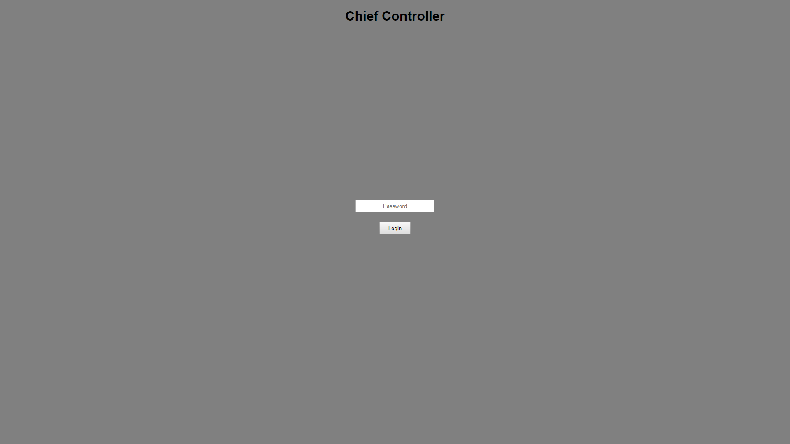

The login screen is the first screen encountered when opening ASPMS.

### How to Login
The default password is "password" (without the quotes). This can be changed to some other value once the user has logged in.

In order to login, enter the password in the text box, and press enter or click Login.

> **NOTE :** ASPMS is a one user system. When one user has logged in, no one else can login till the first user logs out.

## Home
The home page is displayed after logging in.

It consists of 2 regions,
1. Sidebar (Left, minor column)
2. View region (Right, occupies most of the screen)

### Sidebar
*Accounts*

This button opens the Accounts view in the view region. Accounts view is the default view.

*System Parameters*

This button opens the System Parameters view in the view region.

*Apply Changes*

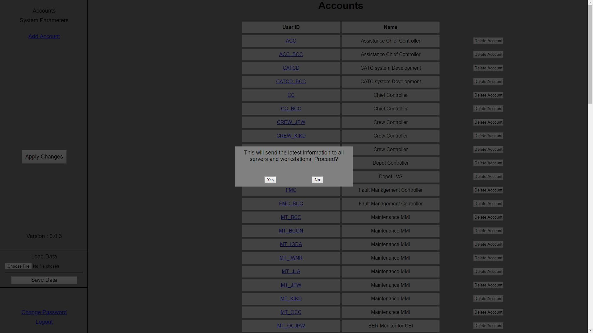
This button applies whatever changes have been saved, and sends them to all the workstations and servers.

Click on **Apply Changes**, and then click **Yes** in the confirmation dialog. Then click **OK** in the success dialog.

*Add Account*

This link can be clicked to add a new account via the Add Account page.

*Change Password*

This link can be clicked to change the existing password via the Change Password page.

*Logout*

### Views

The home page has 2 views
1. Accounts View (Default)
2. System Parameters View

#### Accounts View
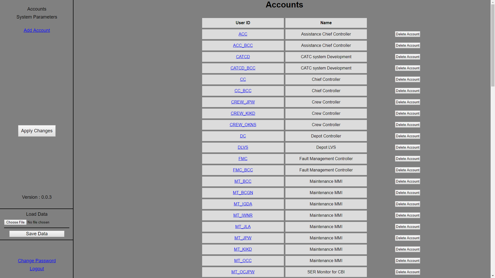
Upon opening home page, this view is shown by default.

It displays all the accounts in the system, along with the following details:
- User ID
- Name

*Add Account*

Click on Add Account link in the sidebar to open the Add Account Page.

*Edit Account*

The user ID is clickable, and can be clicked to open the edit account page.

*Delete Account*

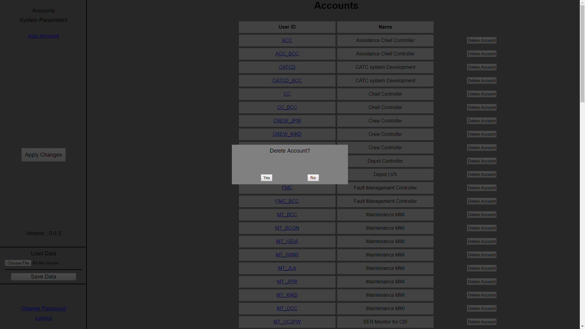
Click on the **Delete Account** button corresponding to that account's user ID. Then click **Yes** in the confirmation dialog. Then click **OK** in the success dialog.

#### System Parameters View
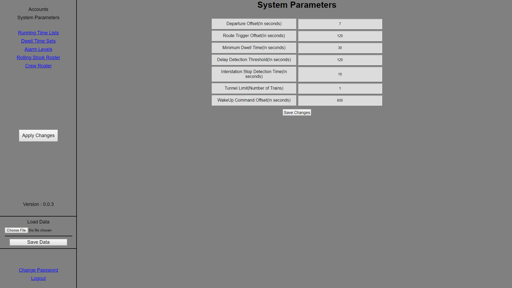
This view lists the following systems parameters:
1. Departure Offset
2. Route Trigger Offset
3. Minimum Dwell Time
4. Delay Detection Threshold
5. Interstation Stop Detection Time
6. Tunnel Limit

*How to Edit*

Each of the above system parameters has a text box next to them. Just click in the text box to edit these values.

*How to Save*
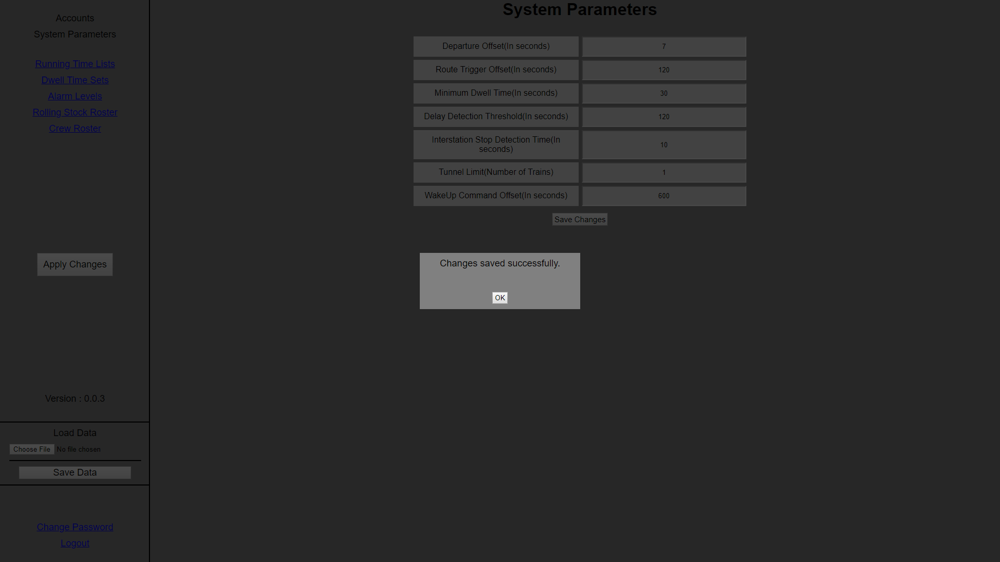
Click on the **Save Changes** button below to save any changes. Then click **OK** in the success dialog.

*Accepted Values*

The values acceptable for each of the above parameters are documented in the table below:

| System Parameter                 | Accepted Value                                                           |
| -------------------------------- | ------------------------------------------------------------------------ |
| Departure Offset                 | Value must be a number **greater than 0** and **lesser than or equal to 999**, decimals are **NOT** allowed. |
| Route Trigger Offset             | Value must be a number **greater than 0** and **lesser than or equal to 999**, decimals are **NOT** allowed. |
| Minimum Dwell Time               | Value must be a number **greater than 0** and **lesser than or equal to 999**, decimals are **NOT** allowed. |
| Delay Detection Threshold        | Value must be a number **greater than 0** and **lesser than or equal to 999**, decimals are **NOT** allowed. |
| Interstation Stop Detection Time | Value must be a number **greater than 0** and **lesser than or equal to 999**, decimals are **NOT** allowed. |
| Tunnel Limit                     | Value must be a number **greater than 0** and **lesser than or equal to 5**, decimals are **NOT** allowed. |

>**NOTE :** New Account cannot be added if invalid information is provided. Appropriate error message will be displayed.
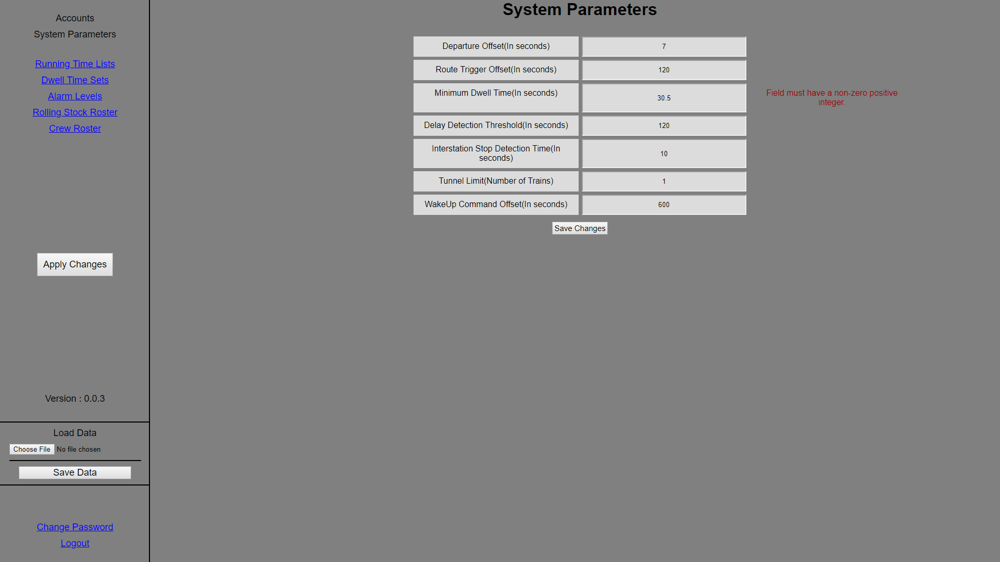

When viewing the System Parameters view, there are 3 more links available in the Sidebar.

*Running Time Lists*

This link can be clicked to open the Running Time Lists page.

*Dwell Time Sets*

This link can be clicked to open the Dwell Time Sets page.

*Alarm Levels*

This link can be clicked to open the Alarm Levels page.

## Add Account

This page allows the user to add a new account to ASPMS.

The following table explains each part of the page:

| Label            | Value                                                             |
| ---------------- | ----------------------------------------------------------------- |
| User Id          | Enter the user ID for the new account.                            |
| Account Name     | Enter the account name for the new account.                       |
| Account Password | Enter the account password for the new account.                   |
| Account ACR      | Choose the regions for which the new account will have authority. |
| Account AOC      | Choose the Area of Control permissions for the new account.       |

*Accepted Values*

The following table lists the accepted values for the text boxes on the Add Account page

| Field Name       | Accepted Value                                                                                                                                           |
| ---------------- | -------------------------------------------------------------------------------------------------------------------------------------------------------- |
| User Id          | Alphabets(A-Z,a-z), Numbers(0-9) and spaces are allowed. Only one space allowed between words. Should **NOT** be empty. Maximum length is 25 characters. |
| Account Name     | Alphabets(A-Z,a-z), Numbers(0-9) and spaces are allowed. Only one space allowed between words. Should **NOT** be empty. Maximum length is 25 characters. |
| Account Password | Should **NOT** contain spaces, all other characters are acceptable . Should **NOT** be empty. Maximum length is 25 characters.                           |

*Line Overview Config*

This Area Of Control permission is further divided into 2 permissions:
1. Enable Global Command
2. Enable Regulation

Both these permissions are automaticaly disabled when Line Overview Config is disabled. They can only be enabled when Line Overview Config is enabled.

*Add Account*

After entering acceptable values, click **Add Account** and then click **OK** in the success dialog.

>**NOTE :** New Account cannot be added if invalid information is provided. Appropriate error message will be displayed.
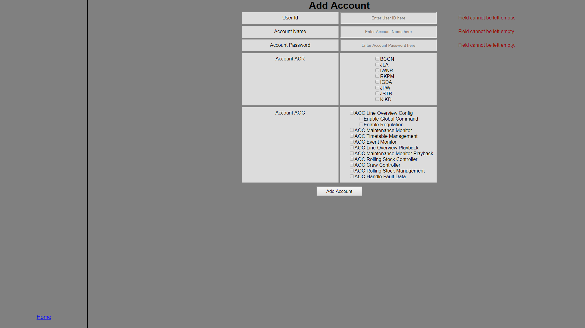

*Home*

Clicking on this link takes the user back to the home page. 

## Edit Account
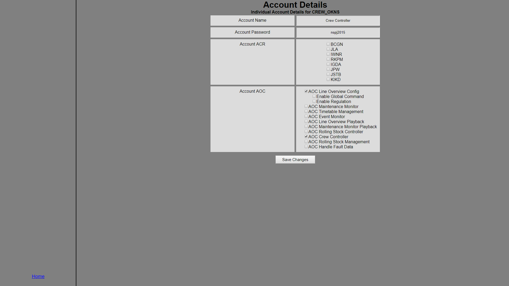
This page allows the user to edit an account in ASPMS.

The following table explains each part of the page:

| Label            | Value                                                             |
| ---------------- | ----------------------------------------------------------------- |
| Account Name     | Enter the new account name for the account.                       |
| Account Password | Enter the new account password for the account.                   |
| Account ACR      | Edit the regions for which the account will have authority. |
| Account AOC      | Edit the Area of Control permissions for the account.       |

*Accepted Values*

The following table lists the accepted values for the text boxes on the Add Account page

| Field Name       | Accepted Value                                                                                                                                           |
| ---------------- | -------------------------------------------------------------------------------------------------------------------------------------------------------- |
| Account Name     | Alphabets(A-Z,a-z), Numbers(0-9) and spaces are allowed. Only one space allowed between words. Should **NOT** be empty. Maximum length is 25 characters. |
| Account Password | Should **NOT** contain spaces, all other characters are acceptable . Should **NOT** be empty. Maximum length is 25 characters.                           |

*Line Overview Config*

This Area Of Control permission is further divided into 2 permissions:
1. Enable Global Command
2. Enable Regulation

Both these permissions are automaticaly disabled when Line Overview Config is disabled. They can only be enabled when Line Overview Config is enabled.

*Save Changes*

After entering acceptable values, click **Save Changes** and then click **OK** in the success dialog.

>**NOTE :** Account cannot be changed if invalid information is provided. Appropriate error message will be displayed.
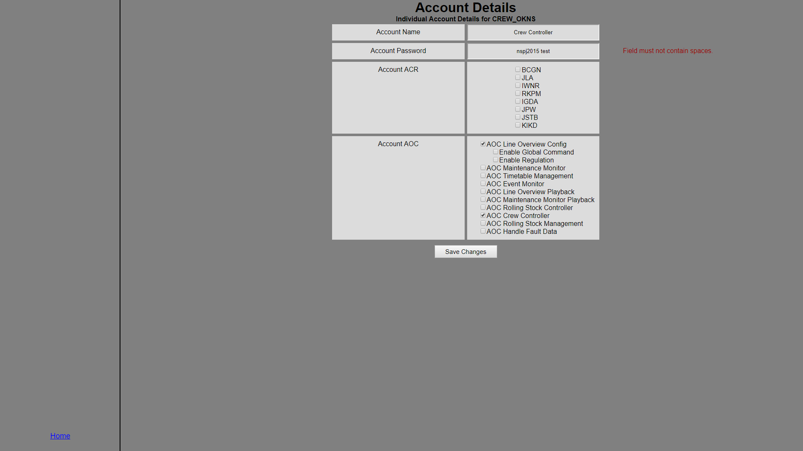

*Home*

Clicking on this link takes the user back to the home page. 

## Running Time Lists
This page consists of 2 regions,
1. Sidebar (Left, minor column)
2. View region (Right, occupies most of the screen)

### Sidebar
*Maximum Performance*

This button opens the Maximum Performance view in the view region.

*Five Percent Coasting*

This button opens the Five Percent Coasting view in the view region.

*Eight Percent Coasting*

This button opens the Eight Percent Coasting view in the view region.

*Energy Saving*

This button opens the Energy Saving view in the view region.

*Full Coasting*

This button opens the Full Coasting view in the view region.

*Save Changes*

Click on **Save Changes** and then click **OK** in the success dialog.

*Home*

Click on **Home** to go back to the home page.

### Views
#### Maximum Performance

Displays the Maximum Performance Running Time Lists.

#### Five Percent Coasting

Displays the Five Percent Coasting Running Time Lists.

#### Eight Percent Coasting

Displays the Eight Percent Coasting Running Time Lists.

#### Energy Saving

Displays the Energy Saving Running Time Lists.

#### Full Coasting

Displays the Full Coasting Running Time Lists.

### How to Edit
In each of the above 5 views, follow these steps to edit:
1. Click on the text box associated with the stop points that you want to edit.
2. Replace the existing value with the new value.

### Accepted Values
All running times must be positive numbers. Maximum value is 999. Fields can **NOT** be left blank.

>**NOTE :** Running Time Lists cannot be changed if invalid information is provided. Appropriate error message will be displayed.
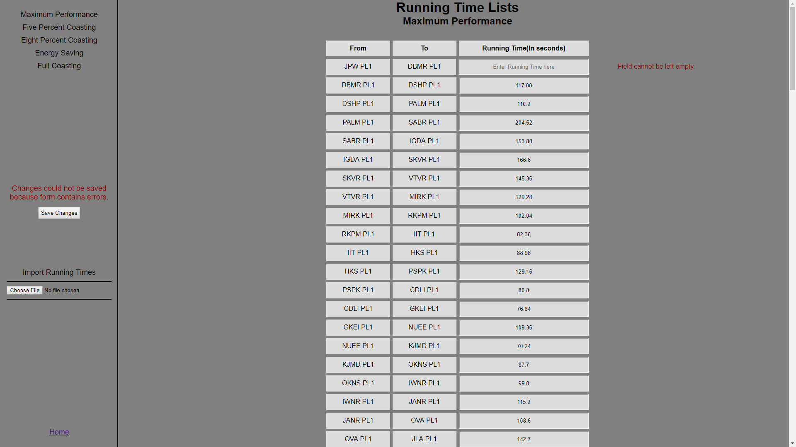

## Dwell Time Sets
This page consists of 2 regions,
1. Sidebar (Left, minor column)
2. View region (Right, occupies most of the screen)

### Sidebar
*Dwell Time Set 1*

This button opens the Dwell Time Set 1 view in the view region.

*Dwell Time Set 2*

This button opens the Dwell Time Set 2 view in the view region.

*Dwell Time Set 3*

This button opens the Dwell Time Set 3 view in the view region.

*Save Changes*

Click on **Save Changes** and then click **OK** in the success dialog.

*Home*

Click on **Home** to go back to the home page.

### Views
#### Dwell Time Set 1

Displays the dwell times for Dwell Time Set 1.

#### Dwell Time Set 2

Displays the dwell times for Dwell Time Set 2.

#### Dwell Time Set 3

Displays the dwell times for Dwell Time Set 3.

### How to Edit
In each of the above 3 views, follow these steps to edit:
1. Click on the text box associated with the stop point that you want to edit.
2. Replace the existing value with the new value.

### Accepted Values
All dwell times must be positive numbers. Maximum value is 999. Decimal values are **NOT** accepted. Fields can **NOT** be left blank.

>**NOTE :** Dwell Time Sets cannot be changed if invalid information is provided. Appropriate error message will be displayed.
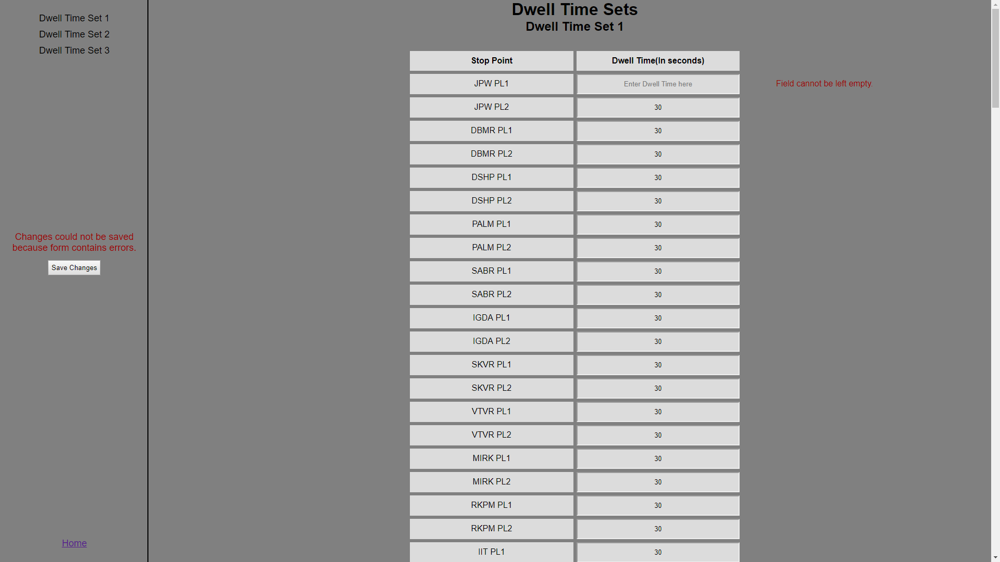

## Alarm Levels
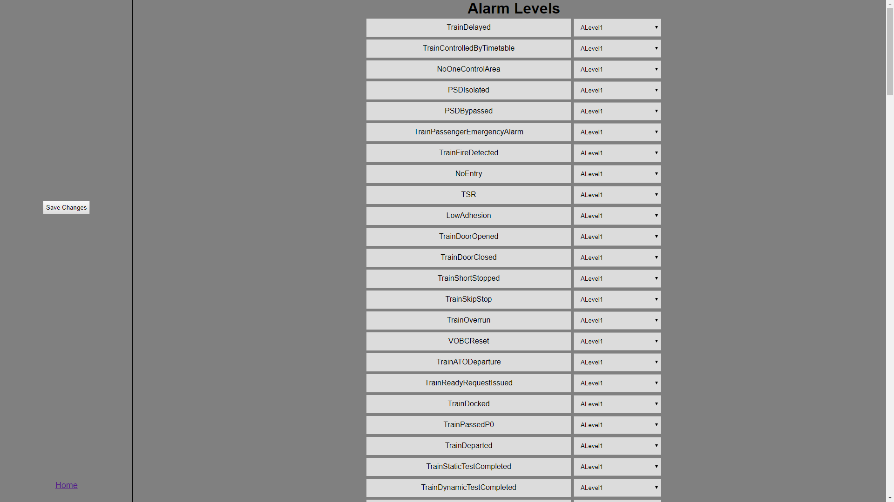
This page displays the alarm level corresponding to each event.

### How to Edit
To edit the alarm level for an event
1. Click the drop down list corresponding to the event.
2. Select the new alarm level from the drop down list.

### How to Save
Click on **Save Changes** and then click **OK** to save the changes.

*Home*

Click on **Home** to go back to the home page.

## Change Password

This page allows you to edit the user password.

### How to Edit
Just enter the new password in the text box.

### How to Save
Click on **Save Changes** and then click **OK** in the success dialog.

### Accepted Values
Spaces are not acceptable, all other characters are accepted. Password must **NOT** be left blank. Maximum length is 25 characters.

>**NOTE :** Password cannot be changed if invalid information is provided. Appropriate error message will be displayed.

*Home*

Click on **Home** to go back to the Home Page.
